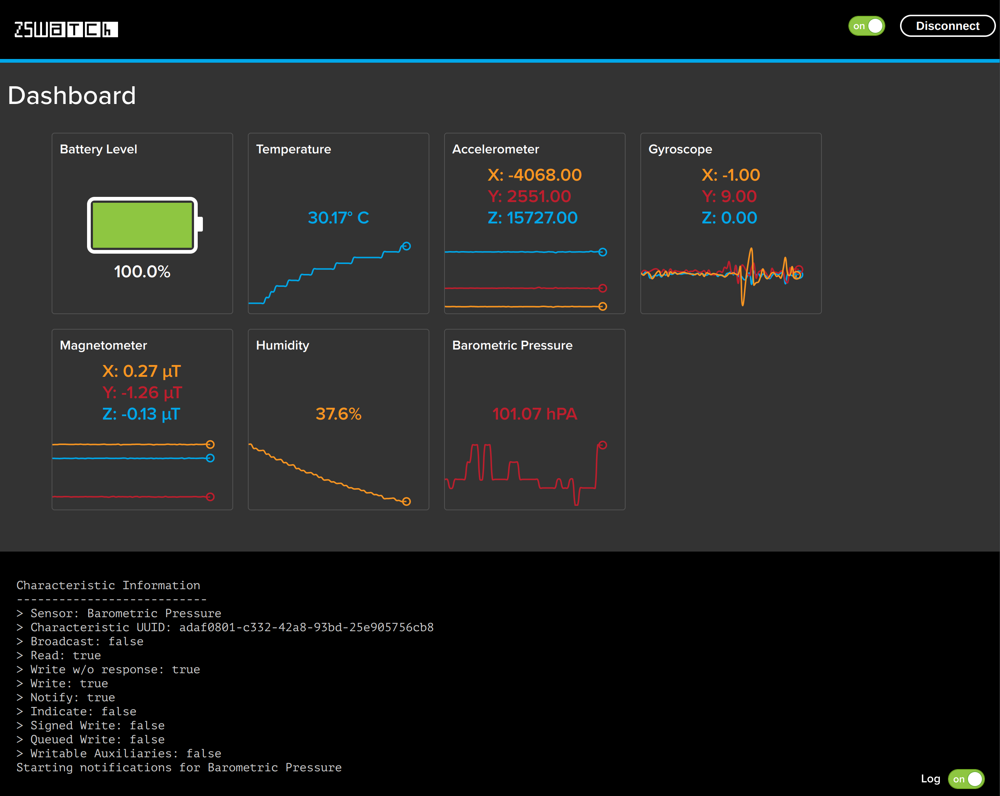

# ZSWatch WebBluetooth Dashboard
<p align="center">
    A Web Bluetooth Dashboard for easily testing sensors etc. on ZSWatch.
</p>
<p align="center">
  
</p>

## Testing locally
Comment out below code in `index.html`, then just open the `index.html` in Chrome.
```
if (window.location.protocol === 'http:') {
  window.location.href = 'https:' + window.location.href.substring(5);
}
```

## Credits
Based on https://github.com/adafruit/Adafruit_WebBluetooth_Dashboard
